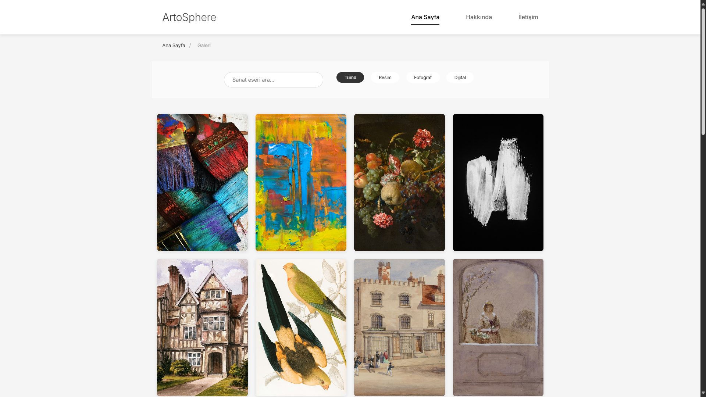
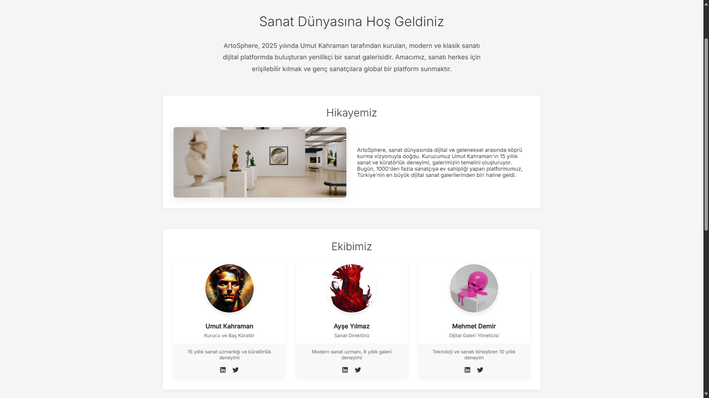
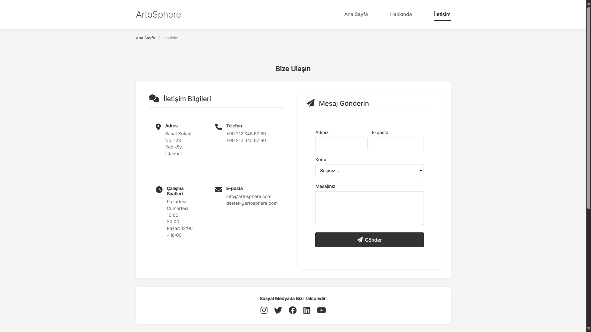

# ArtoSphere - Modern Sanat Galerisi


ArtoSphere, modern ve klasik sanat eserlerini dijital platformda sergileyen yenilikçi bir sanat galerisidir. Unsplash API entegrasyonu ile farklı kategorilerdeki sanat eserlerini görüntülemenizi sağlar.

## 🌟 Özellikler

- 🎨 Modern ve responsive tasarım
- 🔍 Gelişmiş arama ve filtreleme sistemi
- 📱 Mobil uyumlu arayüz
- 🖼️ Masonry grid layout
- 🔄 Lazy loading desteği
- ♿ Erişilebilirlik (ARIA) uyumlu
- 🔒 Güvenli API entegrasyonu
- 📝 İletişim formu
- 🌐 SEO optimizasyonu

## 🛠️ Teknolojiler

- HTML5
- CSS3 (Modern özellikler ve animasyonlar)
- JavaScript (ES6+)
- Unsplash API
- Font Awesome ikonları
- Google Fonts (Inter)

## 📦 Kurulum

1. Projeyi klonlayın:
```bash
git clone https://github.com/UmutTKMN/artosphere.git
```

2. Proje dizinine gidin:
```bash
cd artosphere
```

3. Unsplash API anahtarınızı `js/script.js` dosyasında güncelleyin:
```javascript
const config = {
    UNSPLASH_API_KEY: 'sizin-api-anahtarınız',
    UNSPLASH_API_URL: 'https://api.unsplash.com'
};
```

4. `index.html` dosyasını bir web tarayıcısında açın.

## 🎯 Kullanım

### Ana Sayfa
- Sanat eserlerini görüntüleme
- Kategori filtreleme
- Arama yapma
- Eser detaylarını görüntüleme

### Hakkında Sayfası
- Şirket bilgileri
- Ekip üyeleri
- Misyon ve vizyon
- Başarılar

### İletişim Sayfası
- İletişim formu
- Konum bilgisi
- İletişim detayları
- Sosyal medya bağlantıları

## 📱 Ekran Görüntüleri

### Ana Sayfa


### Galeri


### Hakkında


### İletişim


## 🔒 Güvenlik

- API anahtarı güvenli bir şekilde saklanır
- XSS koruması
- Form doğrulama
- Güvenli HTTP bağlantıları

## ♿ Erişilebilirlik

- ARIA etiketleri
- Klavye navigasyonu
- Ekran okuyucu uyumluluğu
- Yüksek kontrast oranları

## 🔍 SEO

- Meta etiketleri
- Semantic HTML
- Canonical URL'ler
- Open Graph ve Twitter Card desteği

## 📦 Proje Yapısı

```
artosphere/
├── index.html
├── about.html
├── contact.html
├── css/
│   └── style.css
├── js/
│   └── script.js
├── images/
│   ├── logo.png
│   ├── screenshots/
│   └── gallery/
└── README.md
```

## 🤝 Katkıda Bulunma

1. Bu depoyu fork edin
2. Yeni bir branch oluşturun (`git checkout -b feature/yeniOzellik`)
3. Değişikliklerinizi commit edin (`git commit -am 'Yeni özellik eklendi'`)
4. Branch'inizi push edin (`git push origin feature/yeniOzellik`)
5. Pull Request oluşturun

## 📄 Lisans

Bu proje MIT lisansı altında lisanslanmıştır. Detaylar için [LICENSE](LICENSE) dosyasına bakın.

## 📞 İletişim

- Website: [kahrastudio.art](https://kahrastudio.art)
- Email: info@kahrastudio.art
- Twitter: [@kahrastudio](https://twitter.com/kahrastudio)
- Instagram: [@kahrastudio](https://instagram.com/kahrastudio)

## 🙏 Teşekkürler

- [Unsplash](https://unsplash.com) - Görseller için
- [Font Awesome](https://fontawesome.com) - İkonlar için
- [Google Fonts](https://fonts.google.com) - Yazı tipleri için 