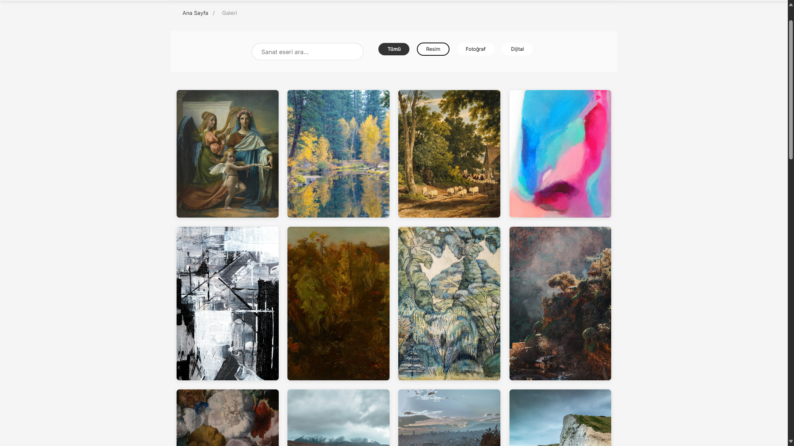

# 🎨 ArtoSphere - Modern Sanat Galerisi

<div align="center">
  
</div>

## 📋 İçerik

- [Proje Hakkında](#-proje-hakkında)
- [Özellikler](#-özellikler)
- [Ekran Görüntüleri](#-ekran-görüntüleri)
- [Teknolojiler](#-teknolojiler)
- [Kurulum](#-kurulum)
- [API Kullanımı](#-api-kullanımı)
- [Hata Giderme](#-hata-giderme)
- [Lisans](#-lisans)

## 🖼️ Proje Hakkında

ArtoSphere, modern ve klasik sanat eserlerini dijital platformda sergileyen yenilikçi bir sanat galerisidir. Unsplash API entegrasyonu sayesinde dünyanın dört bir yanından farklı kategorilerdeki sanat eserlerini görüntülemenizi sağlar.

Masonry grid layout, gelişmiş filtreleme seçenekleri ve kullanıcı dostu arayüzü ile sanat deneyiminizi zenginleştirir. Mobil uyumlu tasarımı sayesinde dilediğiniz cihazdan kolayca erişebilirsiniz.

## ✨ Özellikler

- **🎨 Modern ve Responsive Tasarım**: Her ekran boyutuna uyumlu, şık ve kullanıcı dostu arayüz
- **🔍 Gelişmiş Arama ve Filtreleme**: Sanat eserleri arasında kategoriye göre filtreleme ve arama
- **📱 Mobil Uyumlu Arayüz**: Tablet ve akıllı telefonlarda sorunsuz deneyim
- **🖼️ Masonry Grid Layout**: Estetik ve dinamik galeri görünümü
- **🔄 Lazy Loading Desteği**: Hızlı sayfa yükleme ve optimize performans
- **♿ Erişilebilirlik (ARIA)**: Ekran okuyucularla uyumlu, erişilebilir tasarım
- **🔒 Güvenli API Entegrasyonu**: Unsplash API ile güvenli veri alışverişi
- **📝 İletişim Formu**: Ziyaretçilerle kolay iletişim kurma imkanı
- **🌐 SEO Optimizasyonu**: Arama motorlarında daha iyi görünürlük
- **🌟 Eserlere Özel Modal Görünüm**: Eserleri detaylı inceleme imkanı
- **📊 Galeri İstatistikleri**: Kategorilere göre eser dağılımlarını görüntüleme
- **🔔 Sanat Etkinliği Bildirimleri**: Etkinliklerden haberdar olma özelliği

## 📸 Ekran Görüntüleri

<div align="center">
  
  <p><em>Ana Sayfa</em></p>
  
  
  <p><em>Galeri ve Filtreleme Sistemi</em></p>
  
  
  <p><em>Hakkında Sayfası</em></p>
  
  
  <p><em>İletişim Sayfası</em></p>
</div>

## 🛠️ Teknolojiler

Bu projede aşağıdaki teknolojileri kullanıyoruz:

- **Frontend**:
  - HTML5 - Semantic yapı
  - CSS3 - Modern özellikler ve animasyonlar
  - JavaScript (ES6+) - İnteraktif kullanıcı deneyimi
- **Tasarım**:
  - Responsive Grid Layout
  - Google Fonts (Inter)
  - Font Awesome ikonları
- **API**:
  - [Unsplash API](https://unsplash.com/developers) - Görsel içerik

## 🚀 Kurulum

Projeyi yerel ortamınızda çalıştırmak için aşağıdaki adımları takip edin:

### Ön Koşullar

- Modern bir web tarayıcısı (Chrome, Firefox, Safari, Edge)
- Temel kod editörü (VS Code, Sublime Text vb.)
- Unsplash API anahtarı

### Adımlar

1. Projeyi klonlayın:

   ```bash
   git clone https://github.com/UmutTKMN/ArtoSphere.git
   cd artosphere
   ```

2. Unsplash API anahtarınızı `js/script.js` dosyasında güncelleyin:

   ```javascript
   const config = {
     UNSPLASH_API_KEY: "sizin-api-anahtarınız",
     UNSPLASH_API_URL: "https://api.unsplash.com",
   };
   ```

3. `index.html` dosyasını bir web tarayıcısında açın. Yerel bir sunucu kullanmak isterseniz:

   ```bash
   # Python ile basit bir HTTP sunucusu başlatabilirsiniz
   python -m http.server 8000
   ```

4. Tarayıcınızda şu adresi açın: `http://localhost:8000`

## 🔑 API Kullanımı

Bu uygulama, görsel içerikleri çekmek için Unsplash API'sini kullanır. API kullanımıyla ilgili aşağıdaki noktalara dikkat edin:

- Ücretsiz Unsplash API planı saatte 50 istek ile sınırlıdır
- API anahtarınızı güvenli bir şekilde saklayın ve halka açık depolarda paylaşmayın
- API ile çekilen görsellerin telif haklarına dikkat edin ve Unsplash'in kullanım koşullarına uyun
- Üretim ortamında kullanıyorsanız, istek sınırlamalarını ve hata yönetimini göz önünde bulundurun

## 🔧 Hata Giderme

Sık karşılaşılan sorunlar ve çözümleri:

### API Bağlantı Hataları

- API anahtarınızın doğru olduğundan emin olun
- İnternet bağlantınızı kontrol edin
- API kullanım limitinizi aşmadığınızdan emin olun
- Tarayıcı konsolunda hata mesajlarını kontrol edin

### Görüntü Yükleme Sorunları

- Lazy loading scriptlerinin doğru çalıştığından emin olun
- Görüntülerin dosya yollarını kontrol edin
- Unsplash API'den gelen yanıtları tarayıcı konsolunda izleyin

### Filtre ve Arama Sorunları

- JavaScript konsolunda hata mesajlarını kontrol edin
- Kategori ID'lerinin doğru tanımlandığından emin olun
- Tarayıcı önbelleğini temizlemeyi deneyin

## 📄 Lisans

Bu proje MIT lisansı altında lisanslanmıştır. Detaylı bilgi için [LICENSE](LICENSE) dosyasını inceleyebilirsiniz.

---

<div align="center">
  <p>❤️ ile geliştirildi</p>
  <p>
    <a href="https://github.com/kahrastudio">GitHub</a> •
    <a href="https://twitter.com/kahrastudio">Twitter</a>
  </p>
</div>
